<!-- ============================================================ -->
<!-- HERO SECTION -->
<!-- ============================================================ -->

  

 

  <!-- Typing Effect Banner -->
  

  <!-- Status Indicator Badge & Social Badges -->
  
  
  

 

<!-- ============================================================ -->
<!-- CARD DASHBOARD (HIGHLIGHTS) -->
<!-- ============================================================ -->
<table align="center" width="100%">
  <tr>
    <td width="33.3%" align="center" valign="top">
      <h4>⚡ CORE FOCUS</h4>
      
Backend &amp; Distributed Systems, High-Performance Applied ML Pipelines, Event-Driven Architectures

    </td>
    <td width="33.3%" align="center" valign="top">
      <h4>🎓 ACADEMIC BASE</h4>
      
Final-Year Computer Science Undergraduate at CUSAT (Class of 2027)

    </td>
    <td width="33.3%" align="center" valign="top">
      <h4>🏆 ACHIEVEMENTS</h4>
      
1st Place Vismayam Ideathon, Multi-Hackathon Finalist, NPTEL IIT Distinctions

    </td>
  </tr>
</table>

 

<!-- ============================================================ -->
<!-- ABOUT ME -->
<!-- ============================================================ -->
### 👤 About Me

> I design backend architectures and applied ML pipelines that hold up under real constraints — a RAG platform tuned to run inside a 512MB, single-core deployment; a resume-evaluation pipeline that processes candidates in parallel batches without blocking; a multi-agent system with a human-in-the-loop review layer instead of full autonomy.
>
> Currently completing my final year of a B.Tech in Computer Science at CUSAT (graduating 2027), and looking for full-time Software Engineering / AI-ML Engineering roles.

---

<!-- ============================================================ -->
<!-- CORE EXPERTISE GRID -->
<!-- ============================================================ -->
### 🛠️ Core Expertise Matrix

<table width="100%">
  <tr>
    <td width="50%" valign="top">
      <h4>💻 Languages &amp; Core</h4>
      
      
      
      
        
      <h4>🧠 AI / ML &amp; RAG</h4>
      
      
      
      
      
      
    </td>
    <td width="50%" valign="top">
      <h4>⚡ Backend &amp; Distributed</h4>
      
      
      
      
      
        
      <h4>☁️ Infrastructure &amp; Databases</h4>
      
      
      
      
      
      
      
    </td>
  </tr>
</table>

---

<!-- ============================================================ -->
<!-- FEATURED PROJECTS GRID -->
<!-- ============================================================ -->
### 🚀 Flagship Repositories

<table width="100%">
  <tr>
    <td width="50%" valign="top">
      <h4>⚡ Atlan AI</h4>
      
<strong>AI Customer Support Copilot (Production-Grade RAG)</strong>

      
<i>Problem:</i> Support teams need fast, reliable answers grounded in documentation without paying high infra costs.

      
<i>Solution &amp; Result:</i> Deployed a hybrid FAISS + BM25 search merged with Reciprocal Rank Fusion &amp; cross-encoder rerankers on a 512MB RAM tier, boosting accuracy by 20% to ~95% with sub-1ms cached responses.

      

        
        
        
        
      

      <a href="https://github.com/Sai-developer-6699/support-copilot-rag"><b>Explore Repository →</b></a>
    </td>
    <td width="50%" valign="top">
      <h4>🛡️ AegisHire AI</h4>
      
<strong>Intelligent Applicant Tracking System (Scale-Optimized)</strong>

      
<i>Problem:</i> Resume screening is manual, slow, and concurrent evaluation tasks introduce race conditions in the DB.

      
<i>Solution &amp; Result:</i> Engineered a Django REST Framework pipeline backed by Celery/Redis batching and row-level database locking, cutting active screening times by 90%+ across 10k+ profiles.

      

        
        
        
        
      

      <a href="https://github.com/Sai-developer-6699/AegisHire"><b>Explore Repository →</b></a>
    </td>
  </tr>
  <tr>
    <td width="50%" valign="top">
      <h4>🧠 NeuroTutor</h4>
      
<strong>AI-Powered Spaced-Repetition Platform</strong>

      
<i>Problem:</i> Static tutoring systems fail to adjust dynamically to individual learning speed and knowledge retention.

      
<i>Solution &amp; Result:</i> Implemented Bloom's Taxonomy-based selector and SM-2 algorithm via async Django (ADRF) streaming responses, currently trialed with 10 students with load-tested GPU failovers.

      

        
        
        
        
      

      <a href="https://github.com/Sai-developer-6699/Neurotutor"><b>Explore Repository →</b></a>
    </td>
    <td width="50%" valign="top">
      <h4>🔄 RetentionX</h4>
      
<strong>Autonomous Customer Lifecycle Agent Mesh</strong>

      
<i>Problem:</i> Purely autonomous AI agents acting on production data present high security and business compliance risks.

      
<i>Solution &amp; Result:</i> Architected a 5-agent mesh on Google ADK with a human-in-the-loop Streamlit queue feeding an RLHF loop, reaching the finals in a live hackathon with 30 competing teams.

      

        
        
        
        
      

      <a href="https://github.com/Sai-developer-6699/RetentionX"><b>Explore Repository →</b></a>
    </td>
  </tr>
</table>

---

<!-- ============================================================ -->
<!-- ENGINEERING PHILOSOPHY -->
<!-- ============================================================ -->
### 💡 Engineering Philosophy

> **"Constraints are a design input, not an afterthought."**
> Atlan AI's architecture succeeded by adapting to a 512MB RAM free tier, not by scaling back later. Systems that execute actions autonomously must have a built-in checkpoint for human review—that is why RetentionX's human-in-the-loop queue was engineered as a core component rather than a post-launch add-on. Systems must fail safe: a robust drift-detection and rule-based safety net is essential when models behave unpredictably.

---

<!-- ============================================================ -->
<!-- ANALYTICS DASHBOARD -->
<!-- ============================================================ -->
### 📊 GitHub Analytics

<table width="100%">
  <tr>
    <td width="50%" align="center" valign="top">
      
    </td>
    <td width="50%" align="center" valign="top">
      
    </td>
  </tr>
  <tr>
    <td colspan="2" align="center" valign="top">
      
    </td>
  </tr>
</table>

---

<!-- ============================================================ -->
<!-- INTERACTIVE TIMELINE / CERTIFICATIONS -->
<!-- ============================================================ -->
### 📅 Milestones & Credentials

<strong>💼 Timeline &amp; Experience</strong>

 

| Year | Milestone / Role | Organization |
| :--- | :--- | :--- |
| **2027** | Graduating with B.Tech in CS (seeking full-time roles) | CUSAT |
| **2026** | ML Intern | Mirrorfolio |
| **2025** | ML Intern | EBTS |
| **2025** | Software Development Intern | Safe Integrated Solutions |
| **2025** | Research Intern | ACARR (CUSAT) |
| **2024** | Software Development Intern | Softronics |
| **2023** | Began B.Tech Computer Science | Cochin University of Science &amp; Technology |
| **2022** | School Topper (Class XII - 96%) | Amrita Vidyalayam |

<strong>📜 Certifications</strong>

 

*   **Distributed Systems** — NPTEL, IIT
*   **Large Language Models** — NPTEL, IIT
*   **Information Retrieval** — NPTEL, IIT
*   **AWS Skill Builder** — Foundational Cloud Badges
*   **Google Cloud Skills Boost** — Managed Services &amp; Serverless Badges

<strong>🏆 Achievements</strong>

 

*   **1st Place Winner** — Vismayam Ideathon
*   **Finalist** — CodeSprint, Neurobots, HackNight 2.0
*   **Excellent Student Award** — Honored for Leadership &amp; Academics

---

<!-- ============================================================ -->
<!-- CONNECT & FOOTER -->
<!-- ============================================================ -->

  <h3>🤝 Let's Collaborate</h3>
  
I am always looking for challenging problems in scalable backends, RAG, and agentic AI systems.

  
  
  
  
    
  

